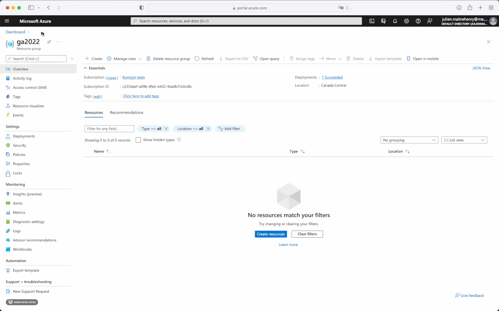

# Lab 1 - Build and Push Containers to Azure Container Registry

The first step will be to create a Docker Registry, we will use [Azure Container Registry](https://azure.microsoft.com/en-ca/services/container-registry/#overview){:target="_blank"} for that.

## Create an Azure Container Registry

### Resource Group

If needed, a new `Resource Group` can be created. It is recommended to create a new resource group for this tutorial, after which cleaning up will be easier.

In Azure Portal's [Resource groups](https://portal.azure.com/#blade/HubsExtension/BrowseResourceGroups){:target="_blank"}, create a new resource group under your subscription.

### Container Registry

In Azure Portal, create a new registry. You have many way of creating a ressource in Azure Portal

#### On the top left menu


#### In a Ressource Group


#### In the pannel of the product you want to create


#### Creating the registry

Now, choose your subscription, ressource group, a name and a location.
For the SKU, choose Basic as we do not need more for this workshop.


After the registry is created, in that registry's Settings > Access Key, enable `Admin user`. This may not always be adviseable, but this enables the manual deployment in the `lab-2` tutorial.


>__Note:__ The Access Keys method should be replaced by using a service principal when possible as it's not the most secure way to connect to the registry.
> Also, the key in the screenshot are no more valid, if you share a key, you can rotate it to invalidate it ;-)

## Build and Push the Containers

This step builds the two applications locally:

```bash
docker build -t <registry-name>.azurecr.io/words:1.0.0 ./words
docker build -t <registry-name>.azurecr.io/web:1.0.0 ./web
```

Then the following will log into Azure, and push the containers.

During the login, use the registry's admin user's name and password from the previous step.

```bash
docker login <registry-name>.azurecr.io
docker push <registry-name>.azurecr.io/words:1.0.0
docker push <registry-name>.azurecr.io/web:1.0.0
```

Finally, in the registry's Services > Repositories, validate that the two Docker images were pushed successfully.


## Summary

In this step, we created a private docker registry, built two docker images and pushed them into the cloud.

> __Note on public and private registries:__ When a project contains private or sensitive data, it is important to use a private registry. Other projects, such as open-source applications, may be pushed to public registries so that everyone can pull them. [Docker Hub](https://hub.docker.com){:target="_blank"} is a popular service that offers both public and private registries.
